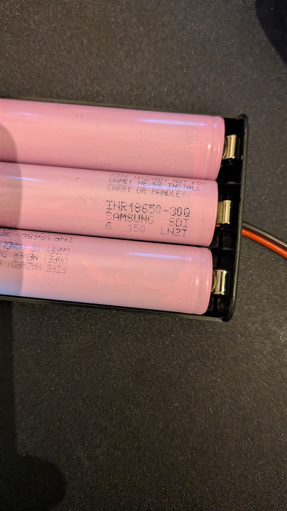
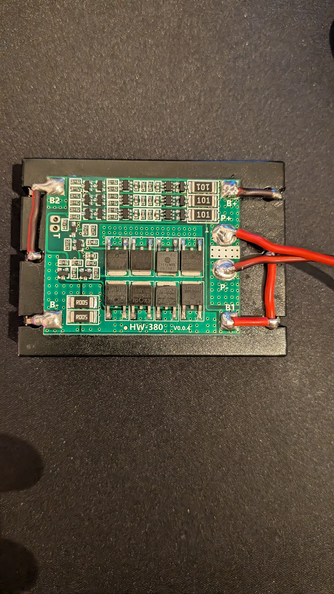
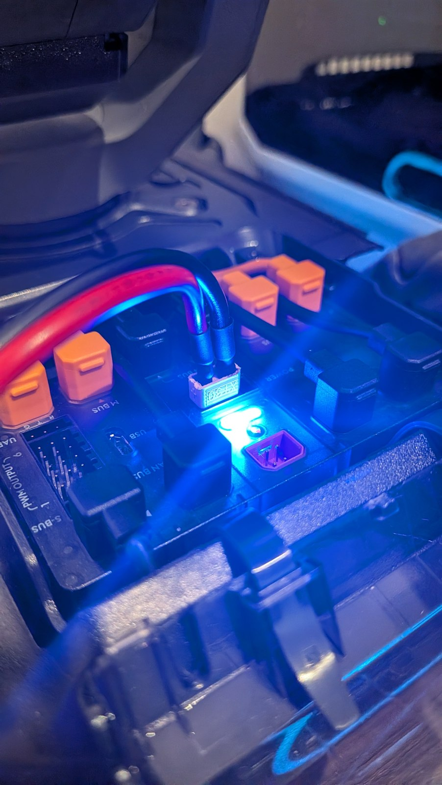

# XT30 Battery Mod

Run the RoboMaster S1 from a protected external battery through XT30 and display
an estimated charge level in the **RoboMaster app battery indicator**.
The robot measures voltage internally. Installation, automatic startup and
removal use **one Python Lab script**. No external telemetry board, ADB,
firmware flash or app modification is required by this product.

The same script includes a robot-side RAM filter for the app's **missing battery
information and battery authentication errors**. All other
diagnostics, including electrical alarms, are preserved. This new filter has
passed offline ARM emulation and lifecycle tests, but **has not yet been
validated on the real robot**.

> **An external lithium battery must have an independent BMS.** The estimate
> does not monitor individual cells, current or temperature and does not stop
> the robot at low charge. Installation disables the original capacity and
> authentication motor gates. Read [Battery power and BMS](../docs/BATTERY-POWER.md)
> and [Safety](../docs/SAFETY.md) before connecting a battery.

## Compatibility and validation

The robot runtime is restricted to exact native executable and stock-script
hashes. See [Compatibility](../docs/FIRMWARE-COMPATIBILITY.md). Unknown builds
and unsafe controller states are refused.

The runtime supports internal voltage estimation, native app telemetry and
startup after reboot. **The combined installer remains experimental:** its
end-to-end hardware acceptance test, app/platform coverage and real-battery
load calibration are not complete. The offline test suite does not validate
the safety of a connected battery or its power system.

## What you need

- The exact supported RoboMaster S1 build and its Python Lab editor.
- A suitable **high-discharge 3S lithium-ion/LiPo pack rated for 4.2 V maximum
  per cell**, with an independent, correctly configured BMS and cell balancing.
  Use cells with a documented discharge rating suitable for motor loads, such
  as the **Samsung INR18650-30Q** in the tested setup below. Capacity
  in mAh alone is not enough. Other chemistries and cell counts are outside
  the current estimate's scope.
- Correct polarity, insulated wiring and connectors rated for the measured
  continuous and peak current, a fuse near the source, and a physical disconnect.
- A power system designed for current returned by the motors during braking,
  including a full battery or a BMS disconnect. A BMS alone does not guarantee
  that the robot supply rail is protected from regeneration.
- A stable stand with all four wheels clear for installation, removal and the
  first motion checks. The stock Lab framework may initialize actuators.

There are no battery data-bus connections to add. The connected battery must
remain protected independently of the robot and this script.

## Tested battery setup

The battery setup tested for this project uses **three Samsung INR18650-30Q
cells in series (3S1P)**, a **3S 25A BMS with balancing**, and an **XT30
connection** to the RoboMaster S1.

| Samsung high-discharge cells | Installed balancing BMS | XT30 on the robot |
|---|---|---|
|  |  |  |

See the [battery hardware guide](docs/HARDWARE-SETUP.md) for component
details, the **AliExpress reference for the 3S 25A balanced BMS**, and the
distinction between the board's advertised current and the cells' discharge
rating. Software validation is tracked separately under
[Compatibility and validation](#compatibility-and-validation).

## Install from Lab

1. Open [scripts/xt30_battery.py](scripts/xt30_battery.py) and copy the **whole
   file** into one Python program in the RoboMaster app's Lab editor.
2. Leave the line near the top as `MODE = 'INSTALL'` and run the program.
3. The script verifies the supported files and parameter names, sets the guarded
   XT30 state, installs the estimate and enables automatic startup, then reports
   `INSTALL complete`. An existing matching installation is reused.
4. The estimate and battery warning filter start in the background after Lab
   ends. Use `MODE = 'STATUS'` to read their current state.
5. On later power cycles, connect the RoboMaster app normally. You do not need to
   run Lab or ADB again.

No other file needs to be copied to the robot and nothing is downloaded.

The console identifies the whole **XT30 Battery Mod**, including the controller
changes. `Battery checks: authentication OFF | capacity OFF (verified)` appears
only after the parameter operation and readback succeed. `INSTALL complete`
confirms setup and a background startup request; use `STATUS` to check whether
the estimate and warning filter are actually running. Routine developer JSON,
paths and parameter numbers are omitted from Lab output; failures still abort
the action and report an error.

Installation includes a fixed seven-second wait plus file and parameter checks.
Lab receives the result lines when the action finishes; the estimate starts
separately in the background, without countdown or wait prompts. The small
motion-controller LED blinking yellow means
an autonomous program is running; blinking blue means normal operation, according
to the [DJI manual, page 15](https://dl.djicdn.com/downloads/robomaster-s1/20191122/RoboMaster_S1_User_Manual_v1.6_EN.pdf).
Those colors alone do not verify installation or battery settings.

If Lab reports `No module named 'zlib'` or an `IndentationError` near the
embedded file-list check, replace the whole program with the current generated
script. It uses an uncompressed bundle and explicit validation loops. These
early launcher failures occur before it starts the installation controller.
The complete installation still requires end-to-end verification in Lab.

`INSTALL` can be run again after `DISABLE` or a fault. It stops the previous
estimate, rechecks the controller state and requests one new background run.
Matching installed files are reused. A different version must be removed
first; changed files are never silently overwritten.

**Updating an older installation:** use this same new script with
`MODE = 'UNINSTALL'`, then run it again with `MODE = 'INSTALL'`. No separate
patch, native library download, or second Lab program is needed. The temporary
stock state between the two runs may prevent movement with XT30 power.

## Control and reverse

Change only `MODE` and run the same complete script:

| MODE | Result |
|---|---|
| `INSTALL` | Set XT30 state; install/enable the estimate and battery warning filter; start them in the background |
| `STATUS` | Show installation, estimate and the native warning-filter lease/state |
| `DISABLE` | Stop the estimate/filter and future startup; restore warning reporting; retain files and XT30 settings |
| `UNINSTALL` | Restore warning reporting and stock battery checks; remove the estimate's startup hook and files |

`STATUS` normally prints three compact lines: XT30 installation and auto-start;
estimated charge, voltage and estimator state; battery authentication / missing information warning filtering.
The first line explicitly says `Auth/capacity checks: not read`: STATUS does not
pause the controller to reread those parameters, and neither installation nor
an active warning filter proves their current values. INSTALL and UNINSTALL
report verified checks after their own parameter operation; DISABLE reports
that the checks are unchanged and directs users to UNINSTALL for stock restoration.
Extra diagnostic details appear only when the estimator is stopped or a check fails. The
launcher also prints other actions and errors line by line so Lab does not
collapse their output into one long message. Copy the current **whole script**
and select `MODE = 'STATUS'` to use this formatting with an existing installation;
no reinstall is needed just to read its status.

For a **complete reversal**, set `MODE = 'UNINSTALL'`, run it, wait for
`UNINSTALL complete`, and reboot once. The original smart battery checks are
active again; normal operation then requires a working original smart battery.
The reboot also clears temporary telemetry frequency settings, unused RAM
storage, logs and locks. This intentionally restores the documented stock
controller state, rather than leaving a pre-existing bypass enabled.

The Lab stop button does not disable the installed background process. A
reboot alone does not undo installation or the persistent controller settings.
`DISABLE` does not restore the motor gates; use `UNINSTALL` for that.

Removal checks the native battery readers are restored and verifies the stock
controller state before deleting recovery files. If a check fails, the script
reports an error and retains the installed files, normally with automatic
startup disabled. Do not treat an error message as a completed reversal.

## What the estimate means

The worker uses a piecewise 3S voltage curve, a 30-second median window and a
gradual filter. Lower percentages require repeated confirmation; upward
recovery is limited to roughly one percentage point per minute.

| Pack voltage | Approximate curve value before filtering |
|---|---|
| 10.35 V | 5% |
| 11.22 V | 20% |
| 11.46 V | 50% |
| 12.00 V | 80% |
| 12.30 V | 90% |
| 12.60 V | 100% |

The filters reduce brief load-induced changes but delay sustained changes too.
Repeated loads, temperature, aging and startup under load can bias the result. The displayed number is neither
remaining runtime nor a safe-discharge guarantee. **Never wait for 0% to decide
whether the battery is safe.**

## Expected limits and failures

- With the new filter active, only the chassis diagnostic IDs `0300C205` and
  `0300C209` are removed from the copy sent to the app. The original internal
  diagnostics, other destinations and battery percentage are unchanged.
  This does not authenticate a smart battery or modify the app.
- These battery warnings may appear before startup, after a fault or after `DISABLE`. The native
  filter automatically passes the original messages when its three-second
  lease is not renewed. Normal stop also restores the original send import;
  an explicit disable/uninstall can recover an expired orphan hook.
- Installing/removing that RAM import briefly pauses the system service with
  a separate one-second rescue process. Perform these actions with the robot
  stationary and wheels clear. Native code is retained dormant until reboot
  to protect in-flight calls; stock executable files are never written.
- Electrical alarm messages remain enabled, but the XT30 estimate does not
  acquire missing current, temperature or cell measurements.
- A missing/frozen voltage source, unexpected native battery data, unsupported
  executable, worker fault or elapsed 24-hour run limit stops the override.
  The display can return to 0%; this does not restore the bypassed motor gates.
- Stock process restarts and faults do not cause unlimited restart attempts.
  Use `STATUS`, then explicit `INSTALL` if appropriate, or reboot.
- A source-reading guard is not an electrical cutoff. Independent cell-level
  protection remains mandatory even when the percentage looks plausible.

Implementation and source build details are in
[Battery XT30 internals](../docs/XT30-BATTERY.md). Building the script is a
**developer step only**; use the generated file linked above for installation.
The new filter implementation and validation boundary are described in
[warning filter internals](src/WARNING_FILTER.md).
