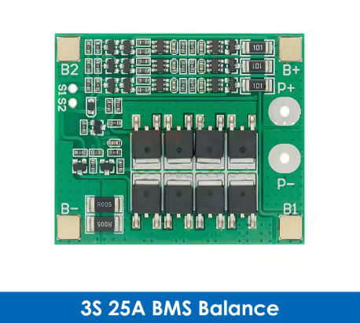

# XT30 battery hardware

Last updated: **2026-09-16**.

This battery setup has been tested on the **RoboMaster S1**. It combines
Samsung high-discharge cells, a balancing BMS and an XT30 power connection.
The photographs show the components and their installation.

## Tested configuration

| Component | Specification |
|---|---|
| Cells | Three **Samsung SDI INR18650-30Q** high-discharge 18650 lithium-ion cells |
| Pack | **3S1P**: three cells in series; 10.8 V nominal, 12.6 V fully charged, approximately 3 Ah nominal |
| BMS | **3S 25A with balancing**, sold as **3S 25A BMS Balance**; the installed PCB is marked **HW-380 V0.0.4** |
| Robot connection | Battery power through **XT30**; no added battery data-bus connection |

Pack voltage and nominal capacity follow from the cell specifications. The
[Samsung SDI INR18650-30Q Version 6 specification, section 3 (PDF hosted by DNK Power)](https://www.dnkpower.com/wp-content/uploads/2025/08/Samsung-inr18650-30q-specification.pdf)
lists 3.6 V nominal, a 4.2 V charge limit and 3,000 mAh nominal per cell.

## High-discharge cells are necessary

Choose a battery designed to supply the robot's motor loads, including current
peaks during acceleration and changes of direction. **A large mAh number alone
does not make a cell suitable.** Cells with insufficient discharge capability
can suffer excessive voltage sag and heating under load.

The tested configuration uses **Samsung SDI INR18650-30Q** high-discharge
cells. When selecting alternatives, check the exact model's discharge rating
and datasheet; brand, size and capacity alone are not enough.

*Samsung INR18650-30Q cells in the three-cell holder.*

The linked Samsung specification lists **15 A maximum continuous discharge
without a temperature cutoff**. Its higher conditional rating depends on
temperature protection; it is not an unconditional rating for this assembly.
In a 3S1P pack the same current flows through each cell: series wiring adds
voltage, not current capability. A **25A BMS does not turn this into a 25 A
continuous-discharge pack**, and the assembled pack may have lower limits
because of its contacts, wiring and thermal conditions. Apply the datasheet
for the actual cell revision and the complete power-system requirements.

## BMS: 3S 25A with balancing

The pack uses a **3S 25A BMS with balancing**. Product reference:

[AliExpress: 3S 25A BMS with balancing, item 1005006427770082](https://it.aliexpress.com/item/1005006427770082.html)

Select the **3S / 25A / Balance (balanced)** version in the
listing. **3S** denotes three series cell groups, **25A** is the advertised
board rating, and **Balance** identifies the version with cell balancing.
Balancing helps keep the series cells at similar charge levels. The BMS is
part of the pack's protection system; it does not replace a suitable charger.

| Installed board | Product reference |
|---|---|
|  |  |

*Installed HW-380 V0.0.4 board on the left; 3S 25A Balance product reference
on the right.*

Verify the documentation and terminal markings for the actual board revision
before wiring. These photographs show the assembly, not a complete wiring
diagram.

The **25A** label does not establish trip thresholds, cell-temperature
protection or performance under braking. Those remain subject to the
[battery power and BMS requirements](../../docs/BATTERY-POWER.md).

## XT30 connection on the RoboMaster S1

*XT30 power connection on the RoboMaster S1 motion controller.*

Verify polarity electrically before connecting a pack.
Protection, insulation, secure mounting and suitable current ratings must
cover the complete assembly, including the cell holder and its contacts.
See [Battery power and BMS](../../docs/BATTERY-POWER.md) for the existing
requirements for a fuse, physical disconnect, charging and regenerative braking.

## Validation status

This battery configuration has been tested in use. Load-current, temperature
and protection-trip measurements are not documented, so it does not define a
universal 25 A pack rating or complete electrical qualification. Software
validation for the installer and warning filter is tracked separately in the
[XT30 guide](../README.md#compatibility-and-validation) and
[implementation notes](../../docs/XT30-BATTERY.md#validation-boundary).

The BMS product reference image is third-party listing artwork.

[Back to the XT30 installation guide](../README.md)
