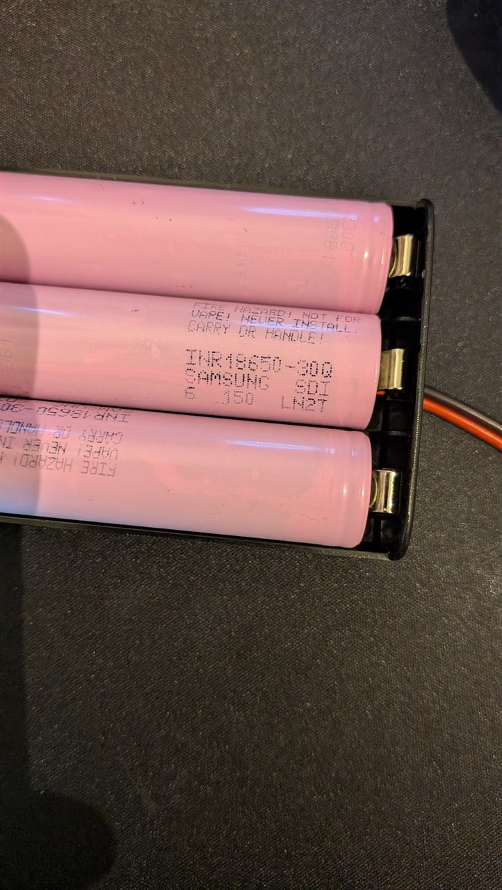
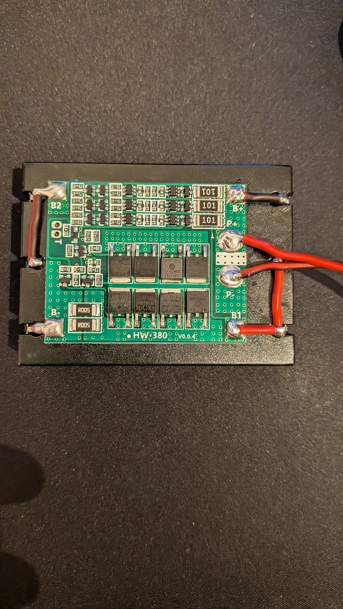
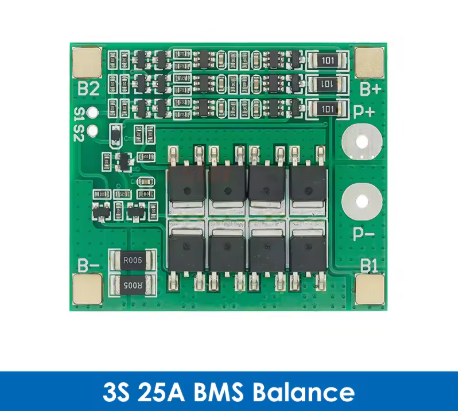
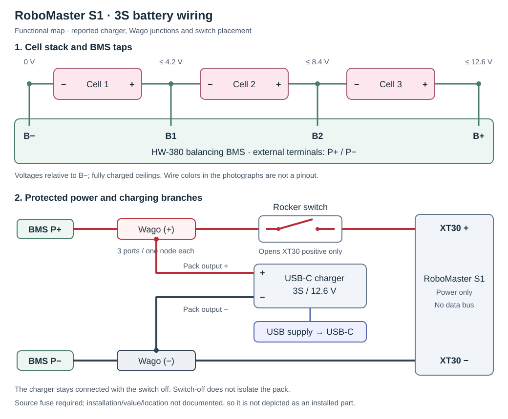
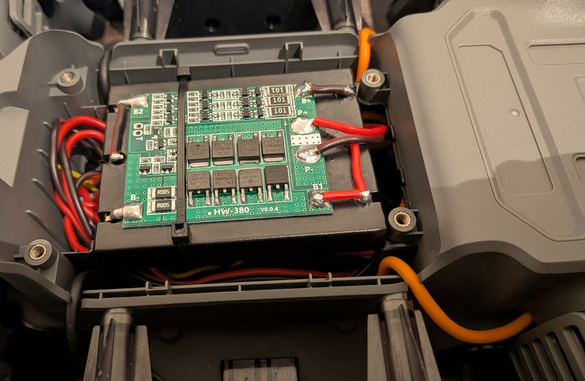
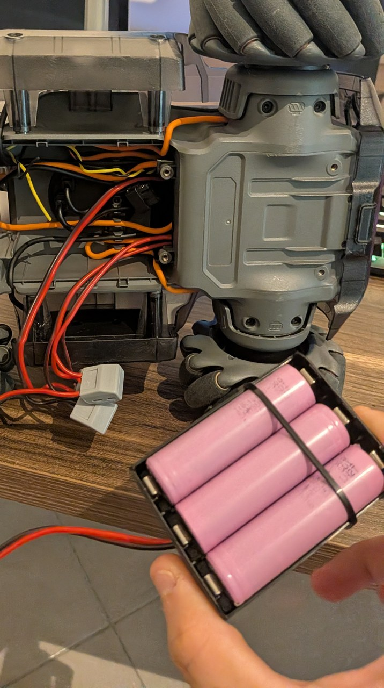
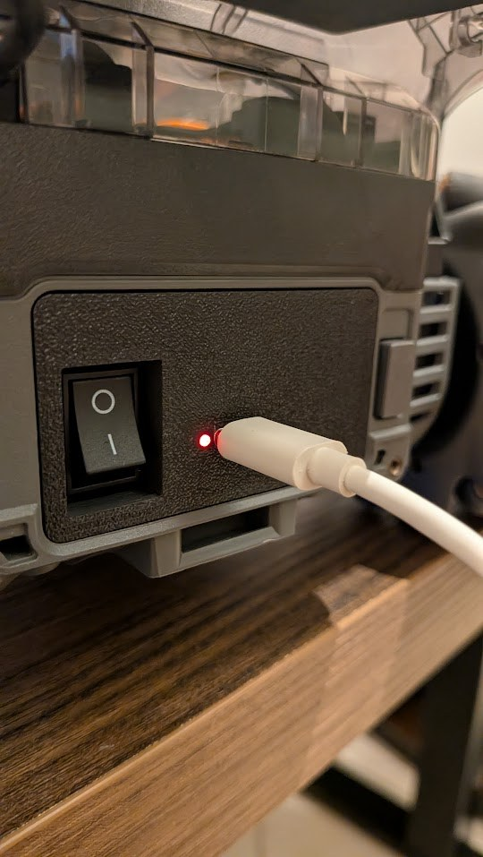
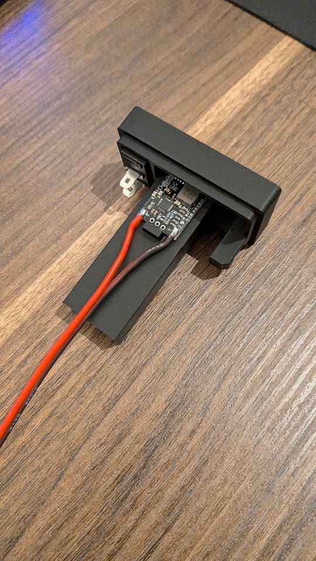
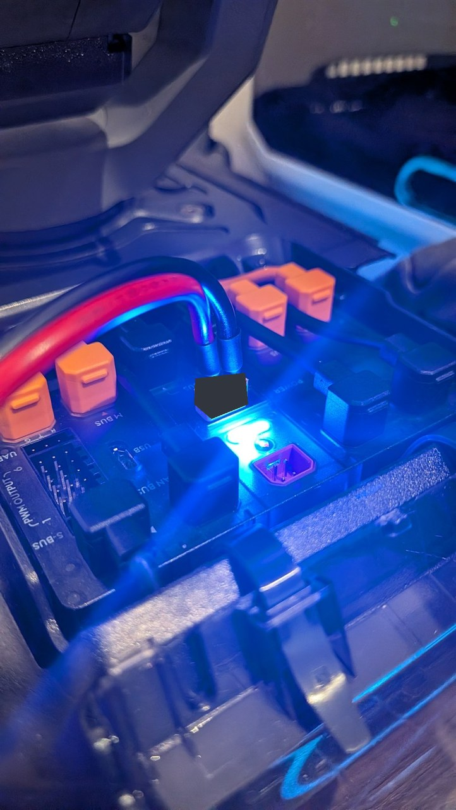

# XT30 battery hardware

Last updated: **2026-10-05**.

This battery setup has been tested on the **RoboMaster S1**. It combines
Samsung high-discharge cells, a balancing BMS and an XT30 power connection.
The photographs show the components, the chassis wiring and the USB-C panel.
The cell/BMS setup was already documented as tested in use; the additional
photographs document its construction, not new electrical acceptance tests.

All photographs are resized to at most 1,280 pixels on their longest edge,
without upscaling or stretching. Click an image for the larger
copy. Published copies omit metadata, robot identifiers and background screen
content; the original photographs are not included.

## Tested configuration

| Component | Specification |
|---|---|
| Cells | Three **Samsung SDI INR18650-30Q** high-discharge 18650 lithium-ion cells |
| Pack | **3S1P**: three cells in series; 10.8 V nominal, 12.6 V fully charged, approximately 3 Ah nominal |
| BMS | **3S 25A with balancing**, sold as **3S 25A BMS Balance**; the installed PCB is marked **HW-380 V0.0.4** |
| Robot connection | Battery power through **XT30**; no added battery data-bus connection |
| Cell holder | Three-cell 18650 holder with connections to both ends and both intermediate series nodes |
| Power switch | Panel rocker switch; reported to interrupt **only the positive lead to XT30** |
| Charging panel | Reported **3S / 12.6 V USB-C charger** connection to BMS `P+`/`P-`; indicator LED and printed mounting panel |
| Power junctions | **Two three-port Wago connectors**, one for positive and one for negative |

Pack voltage and nominal capacity follow from the cell specifications. The
[Samsung SDI INR18650-30Q Version 6 specification, section 3 (PDF hosted by DNK Power)](https://www.dnkpower.com/wp-content/uploads/2025/08/Samsung-inr18650-30q-specification.pdf)
lists 3.6 V nominal, a 4.2 V charge limit and 3,000 mAh nominal per cell.

## High-discharge cells are necessary

Choose a battery designed to supply the robot's motor loads, including current
peaks during acceleration and changes of direction. **A large mAh number alone
does not make a cell suitable.** Cells with insufficient discharge capability
can suffer excessive voltage sag and heating under load.

The tested configuration uses **Samsung SDI INR18650-30Q** high-discharge
cells. When selecting alternatives, check the exact model's discharge rating
and datasheet; brand, size and capacity alone are not enough.

<a href="images/samsung-inr18650-30q-cells.jpg"></a>

*Samsung INR18650-30Q cells in the three-cell holder.*

The linked Samsung specification lists **15 A maximum continuous discharge
without a temperature cutoff**. Its higher conditional rating depends on
temperature protection; it is not an unconditional rating for this assembly.
In a 3S1P pack the same current flows through each cell: series wiring adds
voltage, not current capability. A **25A BMS does not turn this into a 25 A
continuous-discharge pack**, and the assembled pack may have lower limits
because of its contacts, wiring and thermal conditions. Apply the datasheet
for the actual cell revision and the complete power-system requirements.

## BMS: 3S 25A with balancing

The pack uses a **3S 25A BMS with balancing**. Product reference:

[AliExpress: 3S 25A BMS with balancing, item 1005006427770082](https://it.aliexpress.com/item/1005006427770082.html)

Select the **3S / 25A / Balance (balanced)** version in the
listing. **3S** denotes three series cell groups, **25A** is the advertised
board rating, and **Balance** identifies the version with cell balancing.
Balancing helps keep the series cells at similar charge levels. The BMS is
part of the pack's protection system; it does not replace a suitable charger.

| Installed board | Product reference |
|---|---|
| <a href="images/bms-3s-25a-balanced-installed.jpg"></a> | <a href="images/bms-3s-25a-balanced-product.png"></a> |

*Installed HW-380 V0.0.4 board on the left; 3S 25A Balance product reference
on the right.*

Verify the documentation and terminal markings for the actual board revision
before wiring. The terminal map below explains the series-cell connections;
photographs alone cannot establish hidden connections or protection ratings.

The **25A** label does not establish trip thresholds, cell-temperature
protection or performance under braking. Those remain subject to the
[battery power and BMS requirements](../../docs/BATTERY-POWER.md).

## Wiring: cells, BMS and robot

The cell numbers below follow electrical order from pack negative to pack
positive, rather than left-to-right position in the holder:

```text
B- ---- [- Cell 1 +] ---- B1 ---- [- Cell 2 +] ---- B2 ---- [- Cell 3 +] ---- B+
0 V                     up to 4.2 V             up to 8.4 V              up to 12.6 V
```

The voltages are measured **relative to B-** and are the fully charged ceilings
for 4.2 V cells. They are not required readings for a partially charged pack.

| BMS pad | Electrical connection | What it measures/connects |
|---|---|---|
| `B-` | Cell 1 negative; overall pack negative | Reference for the series nodes |
| `B1` | Junction of Cell 1 positive and Cell 2 negative | First cell-group voltage relative to `B-` |
| `B2` | Junction of Cell 2 positive and Cell 3 negative | First two cell groups relative to `B-` |
| `B+` | Cell 3 positive; overall pack positive | Complete 3S stack |
| `P+` | Protected external positive connection | Wago positive junction: charger pack positive and switched robot positive |
| `P-` | Protected external negative connection | Wago negative junction: charger pack negative and robot negative |

Use the board's **P+/P- external terminals** for the load, without bypassing
the protection FETs by returning the robot to `B-`. `B1` and `B2` are intermediate
cell taps, not outputs for accessories. Confirm the actual board's connection
sequence and charge-port arrangement from its documentation.

**Wire color is not a pinout.** In these photographs a dark wire reaches `B+`
and a red wire reaches `B1`. Follow pad labels and measured polarity, including
at XT30; do not copy the colors as a polarity convention.

The following external connections are reported for this assembly. Each Wago
joins three wires at **one electrical node**; the two connectors keep positive
and negative separate. The port numbers below are illustrative, not physical positions:

| Junction | Port 1 | Port 2 | Port 3 |
|---|---|---|---|
| Positive Wago | BMS `P+` | Charge-module pack positive | Rocker-switch input; switch output goes to `XT30 +` |
| Negative Wago | BMS `P-` | Charge-module pack negative | `XT30 -` directly |

The rocker switch opens only the **positive robot branch**, downstream of
the positive Wago. The USB-C charge module remains connected to both Wago
junctions regardless of switch position. Use the module's **pack/charge output**
connections, not its USB input pads, for that branch.

[](images/battery-wiring.svg)

```text
                         +---- charger pack +
BMS P+ ---- Wago (+) -----+
                         +---- rocker switch ---- XT30 + ---- S1

                         +---- charger pack -
BMS P- ---- Wago (-) -----+
                         +----------------------- XT30 - ---- S1

USB supply ---- USB-C charge module (3S / 12.6 V)
```

*Reported connection map. A source fuse is required by the complete
design, but its presence, value and location are not documented, so it is not
shown as an observed component.*

This is a functional connection map, not a qualified assembly drawing or a
specification for fuse, switch, wire or holder current ratings. Disconnect
the source before work. Check individual cell voltages, cumulative tap
voltages and XT30 polarity before connecting the robot. The photographed
exposed pads and joints still require insulation and strain relief in service.

## Chassis installation and cable routing

<a href="images/bms-3s-chassis-installed.jpg"></a>

*BMS installed in the chassis. The visible pad labels correspond to the
terminal map above. The cable tie retains the board; it is not electrical
insulation.*

<a href="images/battery-holder-chassis-wiring.jpg"></a>

*Holder removed from the bay to show cable routing and the three-port Wago
junctions reported for this assembly. The exact connector series, wire range and
current rating are not documented. Keep added leads clear of wheels, moving
parts and closing edges.*

## USB-C charging panel

| External panel | Inside the panel |
|---|---|
| <a href="images/usb-c-charge-panel.jpg"></a> | <a href="images/usb-c-charger-panel-inside.jpg"></a> |

*The installed panel and its interior. The photograph shows a red indicator;
its meaning depends on the exact module and is not a verified full/charging
status indication.*

The USB-C module is reported as the **3S / 12.6 V** version, with its two
pack-output wires connected to the BMS's `P+`/`P-` through the Wago
junctions. The switch controls the XT30 positive branch only. **Switching the
robot off does not isolate the cell pack or the charging branch.** Disconnect
both the pack and USB source before changing wiring.

Do not infer charge current, USB-PD/QC support or cell balancing from the USB-C
connector. The LED's status meanings, charge-current setting and termination
behavior need the actual module's documentation. Keep the robot branch off
during charging; simultaneous charging and robot operation has not been
qualified. A suitable charger and the independent BMS perform different
functions.

## Components and AliExpress references

The BMS, charger and switch links and the MakerWorld print profile are
documented references for this assembly. The charger, switch and MakerWorld
pages could not be independently inspected on 2026-09-30; those links and the
selected 3S configuration remain unverified assembly references.
For remaining parts, **AliExpress search links are search aids**, not exact
purchase records or verified substitutes. Photographs above cover every
supplied view.

| Component | Quantity / selection | Purchase reference |
|---|---|---|
| Samsung INR18650-30Q cells | 3; exact high-discharge model with traceable authenticity and ratings | [AliExpress search: INR18650-30Q](https://www.aliexpress.com/w/wholesale-samsung-inr18650-30q.html) — exact seller not supplied |
| 3S balancing BMS | 1; **3S / 25A / Balance**, HW-380 V0.0.4 in the photographs | [AliExpress item 1005006427770082](https://it.aliexpress.com/item/1005006427770082.html) |
| 18650 holder | 1; three series cells with accessible intermediate taps, verified contact ratings | [AliExpress search: 3S 18650 holder](https://www.aliexpress.com/w/wholesale-3s-18650-battery-holder.html) — exact part not supplied |
| USB-C charge module | 1; reported **3S / 12.6 V** version | [AliExpress item 1005007170943596](https://it.aliexpress.com/item/1005007170943596.html) — unverified assembly reference |
| Rocker switch | 1; two-terminal ON/OFF, correct panel fit and DC switching rating | [AliExpress item 1005009143297950](https://www.aliexpress.com/item/1005009143297950.html) — unverified assembly reference |
| XT30 power connector / lead | Matching connection to the S1, measured polarity | [AliExpress search: XT30 connector](https://www.aliexpress.com/w/wholesale-xt30-connector.html) — exact source not supplied |
| Three-port Wago junctions | 2; separate positive/negative nodes; exact series and ratings to establish | [AliExpress search: Wago 3-port connector](https://www.aliexpress.com/w/wholesale-wago-3-pin-connector.html) — exact source not supplied |
| Source fuse and holder | Required near the source; value/location not documented in the photographed assembly | [AliExpress search: inline DC fuse holder](https://www.aliexpress.com/w/wholesale-inline-dc-fuse-holder.html) — select for the complete design |
| Wire and insulation | Wire gauge, temperature/current rating and strain relief to establish | [AliExpress search: silicone wire](https://www.aliexpress.com/w/wholesale-silicone-wire.html), [heat-shrink tubing](https://www.aliexpress.com/w/wholesale-heat-shrink-tubing.html) — exact sources not supplied |
| Printed panel and mounts | Printed parts for this mod; use the linked model/profile for fit details | [MakerWorld: DJI RoboMaster S1 battery mod, profile 3799310](https://makerworld.com/it/models/3343753-dji-robomaster-s1-battery-mod#profileId-3799310) — unverified assembly print reference |

Marketplace pages may offer different variants or change over time. Select
the documented version and verify the actual part's specifications rather
than relying on its listing title or appearance. No current availability or
price is asserted here.

## XT30 connection on the RoboMaster S1

<a href="images/xt30-connection-robomaster-s1.jpg"></a>

*XT30 power connection on the RoboMaster S1 motion controller.*

Verify polarity electrically before connecting a pack.
Protection, insulation, secure mounting and suitable current ratings must
cover the complete assembly, including the cell holder and its contacts.
See [Battery power and BMS](../../docs/BATTERY-POWER.md) for the existing
requirements for a fuse, physical disconnect, charging and regenerative braking.

## Validation status

This battery configuration has been tested in use. The new photographs and
reported charger, Wago and switch connections are construction evidence.
Module ratings, charge termination and simultaneous charge/load behavior are
not independently validated. Load-current, temperature
and protection-trip measurements are not documented, so it does not define a
universal 25 A pack rating or complete electrical qualification. Software
validation for the installer and warning filter is tracked separately in the
[XT30 guide](../README.md#compatibility-and-validation) and
[implementation notes](../../docs/XT30-BATTERY.md#validation-boundary).

The BMS product reference image is third-party listing artwork.

[Back to the XT30 installation guide](../README.md)
